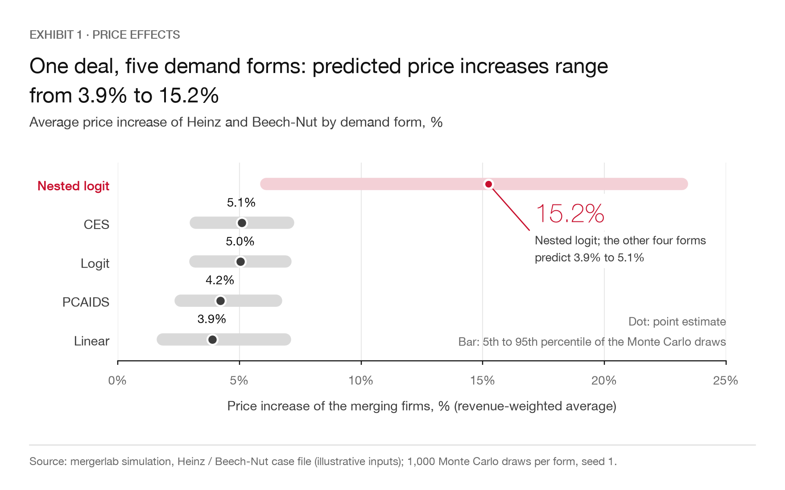
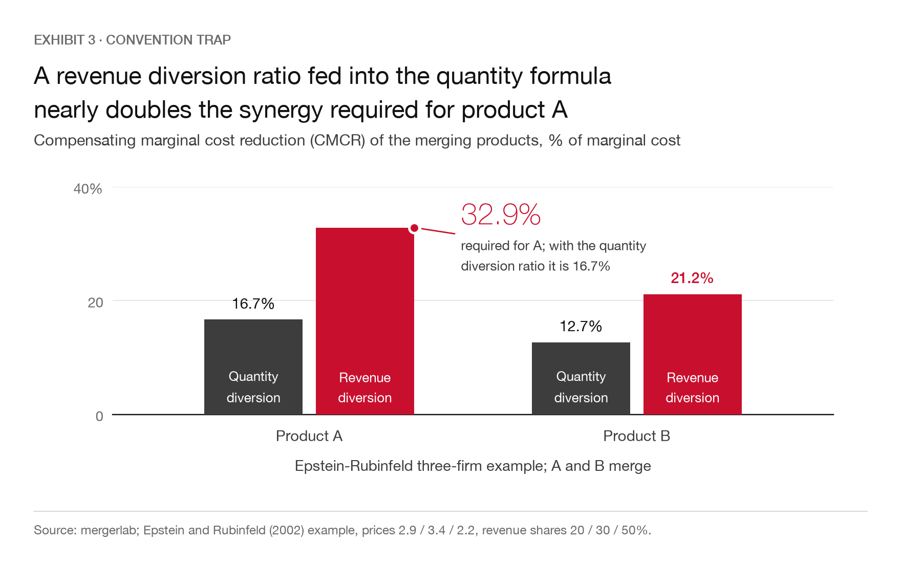
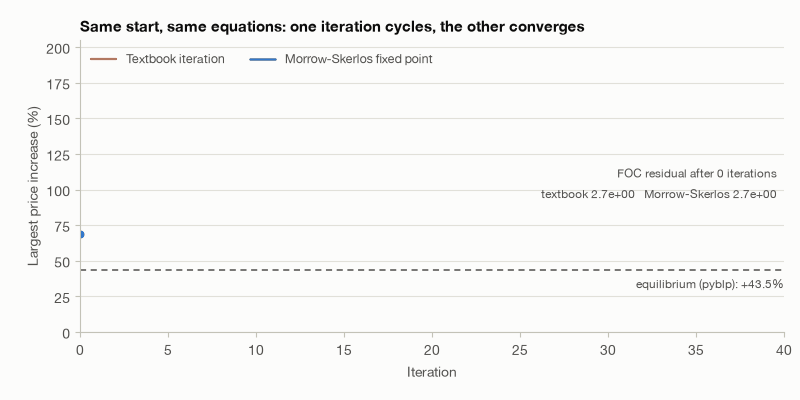
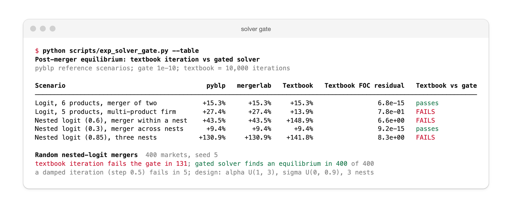
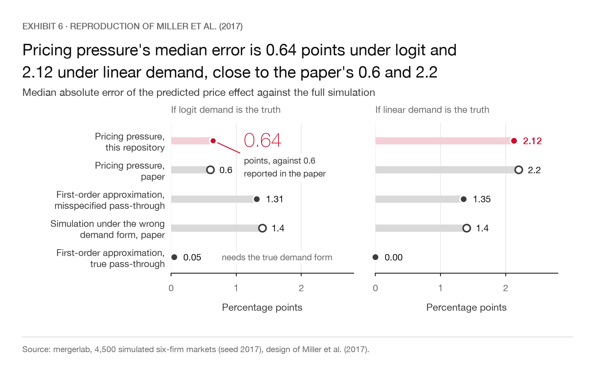
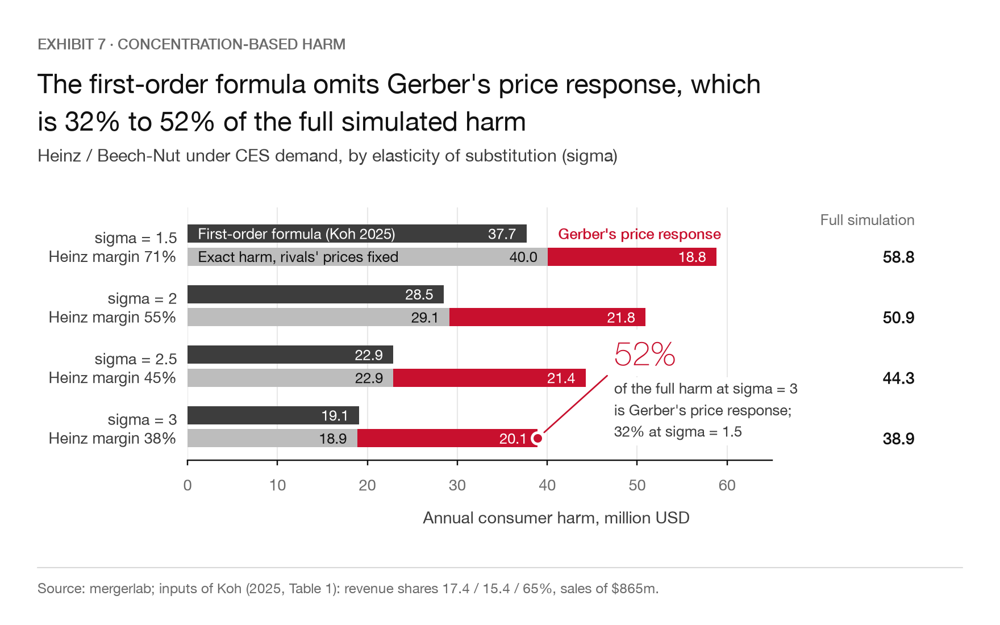
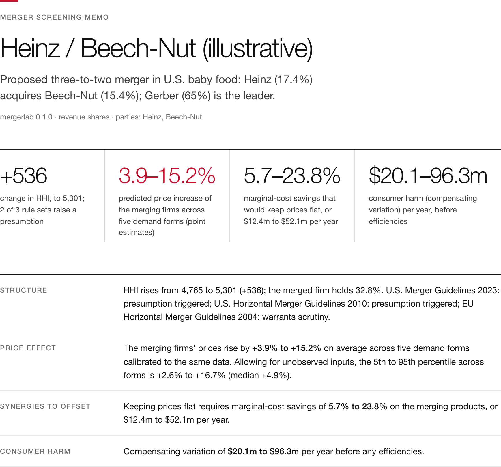
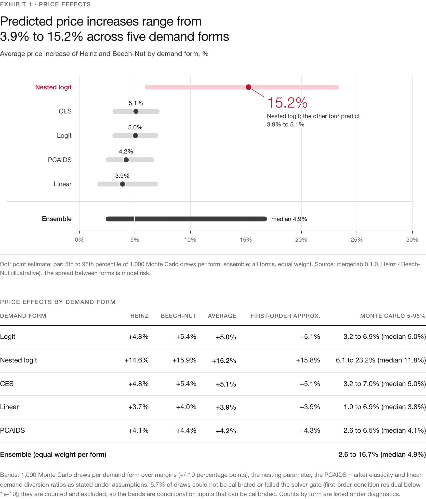
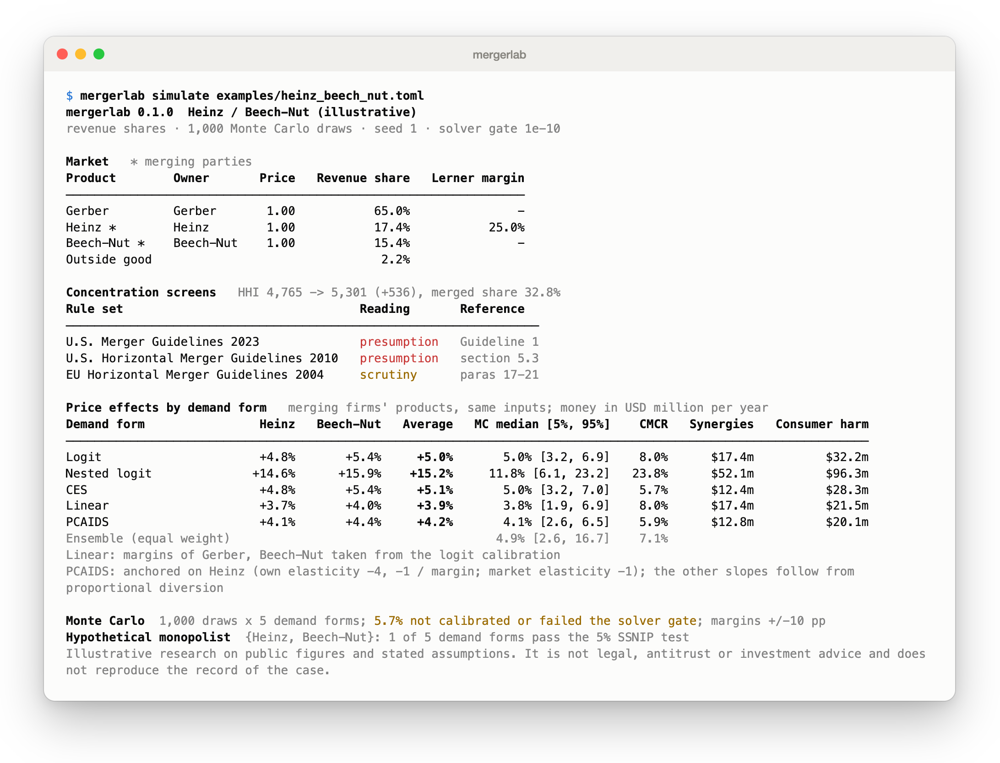

# mergerlab

Calibrated merger simulation and antitrust screening in Python: from shares, prices and margins to price effects, required synergies and guideline screens.

[](https://github.com/Thesimpleex/mergerlab/actions/workflows/ci.yml)




*The Heinz / Beech-Nut example, `mergerlab simulate examples/heinz_beech_nut.toml`: market, guideline screens and the price effect under five demand forms.*

## Why this matters

A first-day screen of a horizontal merger starts from a few numbers: shares, prices and one or two margins. Deal teams, competition economists and strategy consultants then have to say how much prices will rise, how large cost synergies must be to keep them flat, and whether the deal is presumptively problematic under the merger guidelines. The reference toolkits are R packages (`antitrust` and `mergersim` on CRAN); in Python, pyblp is estimation-first and offers no calibration from shares, prices and margins, no UPP, GUPPI or CMCR and no guideline logic. The Python package `mergeron` (PyPI) covers HHI and diversion thresholds, GUPPI, CMCR and an illustrative price rise, but is built for simulating enforcement rates on synthetic markets, not for screening a given deal.

`mergerlab` fills the remaining gap: calibration from a deal's own shares, prices and margins, five demand forms, a gated equilibrium solver and a client-ready memo. The question it is built around: **one deal, several defensible demand curves. How wide is the range of predicted price effects, and what synergies would make the deal price-neutral?** It refuses to return a post-merger equilibrium that does not satisfy the first-order conditions, and it makes mixing up share, margin or diversion conventions a `ValueError`.

## Key results

All numbers below come from `docs/results.json`, written by `scripts/reproduce_all.py`.

### One deal, five demand curves

Heinz / Beech-Nut (FTC v. H.J. Heinz Co., D.C. Cir. 2001), using the public revenue shares 65.0 / 17.4 / 15.4% and annual sales of 865 million USD. The 865 million USD is treated as the sales of the three firms (the inside products); the 2.2% of other sellers sits on top as the outside good, so if 865 were the whole market, every dollar figure would scale by 0.978. Only Heinz's Lerner margin (25%) is assumed; every demand form is calibrated to the same prices, shares and margin, so differences come from the demand form alone. Illustrative research on public figures and stated assumptions, not legal or investment advice.

<picture>
  <source media="(prefers-color-scheme: dark)" srcset="docs/figures/demand_forms-dark.png">
  
</picture>

*Dot: point estimate; bar: 5th to 95th percentile over the successful Monte Carlo draws of each form (of 1,000; nested logit: 716); tick: median. Left: revenue-weighted average price increase of Heinz and Beech-Nut. Right: compensating marginal cost reduction (CMCR).*

- The merger fails the structural screens: HHI rises from 4,765 to 5,301 (+536), the merged share is 32.8%. The 2023 U.S. guidelines and the 2010 U.S. guidelines both give a presumption; the EU guidelines give no indicator of absence of concerns.
- Average price increases of the merging firms: logit 5.0%, CES 5.1%, PCAIDS 4.2%, linear 3.9%, nested logit 15.2%. The Monte Carlo ensemble (equal weight per form) has a median of 4.9% and a 5th to 95th percentile range of 2.6% to 16.7%.
- Keeping prices flat requires marginal-cost savings of 5.7% (CES) to 23.8% (nested logit), or 12.4 to 52.1 million USD per year. Logit and linear demand give the same CMCR (8.0%, 17.4 million USD) because both use the same diversion ratios and margins; the CMCR depends on demand only through them.
- Consumer harm (compensating variation) ranges from 20.1 (PCAIDS) to 96.3 (nested logit) million USD per year.
- The nested-logit result is the outlier because it rests on an assumption the data cannot check: Heinz and Beech-Nut in one nest with nesting parameter 0.4, Gerber alone. It also implies a Gerber margin of 81%, against 59% for logit and 44% for CES, a sign that this nest structure is in tension with the 25% Heinz margin. 28.4% of its Monte Carlo draws cannot be calibrated because the implied Lerner margins leave the interval (0, 1); these draws are counted and excluded from the bands, so the bands are conditional on inputs that can be calibrated. The failures concentrate at high nesting parameters: the failure share rises from 0% to 10%, 34% and 65% across the four quarters of the prior range 0.1 to 0.7, and the mean nesting parameter is 0.34 among successful draws against 0.57 among failed ones. The successful draws still span 0.10 to 0.70, but the effective prior is tilted towards low values. Across all five forms 5.7% of the 5,000 draw-and-form combinations were not calibrated or failed the solver gate.

### The convention trap

<picture>
  <source media="(prefers-color-scheme: dark)" srcset="docs/figures/convention_trap-dark.png">
  
</picture>

In the Epstein-Rubinfeld three-firm example (prices 2.9 / 3.4 / 2.2, revenue shares 20 / 30 / 50%, own elasticity -3, market elasticity -1; A and B merge) the AIDS-type diversion from A to B (R's `antitrust` reports it as a ratio of budget-share slopes) is 0.375. Plugging it into Werden's quantity formula gives a CMCR of 32.9% for A instead of the correct 16.7% (B: 21.2% instead of 12.7%). The typed API makes this impossible: `cmcr_from_diversion` raises "CMCR requires quantity diversion ratios but received revenue diversions; convert with Diversion.to_quantity(prices, own_elasticity) first (share diversions also need shares and market_elasticity)".

Away from a market elasticity of -1 the share-slope ratio is no longer the ratio of revenue changes, and converting it as one is wrong too. At a market elasticity of -1.5 the R-style diversion from A to B is still 0.375, but the quantity diversion is 0.160, not the 0.213 that the revenue-ratio conversion gives; the CMCR is 11.5% and 8.5% for A and B, against 16.4% and 12.6% via the wrong conversion. `Diversion.share(...).to_quantity(prices, own_elasticity, shares=..., market_elasticity=...)` converts exactly, and the result reproduces R's own CMCR to 1e-10 (the tests use R's output at market elasticities -0.7, -1.5 and -2.5).

### Why the solver gate exists

<picture>
  <source media="(prefers-color-scheme: dark)" srcset="docs/animations/solver_iteration-dark.gif">
  
</picture>

On the pyblp nested-logit scenario with nesting parameter 0.6 the textbook iteration cycles between +148.9% and +187.1% and never satisfies the first-order conditions; the equilibrium is +43.5%, which pyblp and `mergerlab` both find. On 400 random nested-logit mergers (six single-product firms, firms 0 and 1 merge; price coefficient U(1, 3), nesting parameter U(0, 0.9), three nests drawn uniformly, mean utilities U(0.5, 2.5), costs U(0.4, 1.0)) the plain undamped iteration (10,000 iterations) fails the residual gate in 131 (33%); the gated solver finds an equilibrium in all 400. The figure is specific to the undamped baseline: a damped iteration (step 0.5, same iteration count) fails in 5 of the 400 (1.2%). The point of the gate is the check, not the claim that every fixed-point scheme fails. Static version: `docs/figures/solver_gate-light.png`.

<picture>
  <source media="(prefers-color-scheme: dark)" srcset="docs/screenshots/solver_gate-dark.png">
  
</picture>

### Reduced reproduction of Miller, Remer, Ryan and Sheu (2017)

<picture>
  <source media="(prefers-color-scheme: dark)" srcset="docs/figures/miller_reproduction-dark.png">
  
</picture>

4,500 simulated six-firm markets, firms 1 and 2 merge. Medians against the paper's Table 1: HHI 1,566 / 1,931 / change 326 (paper 1,562 / 1,931 / 317), upward pricing pressure 0.072 (0.07), logit price effect 0.064 (0.06), linear 0.048 (0.05). Median absolute error of pricing pressure against the simulated logit effect 0.64 percentage points (paper 0.6) and against linear demand 2.12 (paper 2.2). The first-order approximation with the merger pass-through matrix has a median error of 0.05 percentage points under logit demand and is exact under linear demand. That comparison uses the pass-through of the demand system that generated the truth, which pricing pressure (a shortcut that needs no curvature information) does not have, so it is not like for like. With a misspecified pass-through (linear pass-through when logit is the truth, and the reverse) the median error is 1.31 and 1.35 percentage points, the same order as the 1.4 the paper reports for a simulation under the wrong demand form. The paper does not state how shares are drawn; independent uniform draws for the six firms and the outside good, normalised, reproduce its order statistics and are used here (91 non-rationalisable markets were redrawn).

### Concentration-based harm: Koh (2025), formula against exact harm and full simulation

<picture>
  <source media="(prefers-color-scheme: dark)" srcset="docs/figures/koh_first_order-dark.png">
  
</picture>

`koh_decomposition` reproduces Table 1 of Koh (2025) to its printed precision: consumer harm 37.68, 28.48, 22.87 and 19.10 million USD for sigma = 1.5, 2, 2.5 and 3 (rho1 = 0.373, 0.593, 0.738, 0.840; rho2 = 1.09, 1.04, 1.00, 0.98). Two typos in the paper's table and text are visible: the text says 36.68 million where the table says 37.68, and the table prints V0 = 432.00 for sigma = 3 where Y/(sigma-1) = 432.50.

The formula is a first-order statement about the merging products with the rivals' prices held fixed, so the like-for-like benchmark is the exact compensating variation of that same price change. `harm_comparison` computes it: the formula is within 6% of it (ratios 0.94, 0.98, 1.00 and 1.01), so curvature of CES demand explains only 2.4 million USD of the gap at sigma = 1.5 and less beyond. The full simulation (58.8, 50.9, 44.3 and 38.9 million USD) also lets Gerber re-price (+3.0% to +3.4%); that rival response accounts for 32% to 52% of the full harm, and the formula captures 49% to 64% of the full simulated harm. The margins in this comparison are implied by sigma under CES Bertrand pricing (Heinz 71% at sigma = 1.5 down to 38% at sigma = 3); they are not the 25% margin of the case file above.

### The HTML merger memo

`mergerlab simulate case.toml --report memo.html` writes a self-contained memo (inline CSS and SVG): screens with citations, price effects by product with bands, CMCR and dollar synergies, the demand-form comparison, welfare, the hypothetical monopolist test, diagnostics and assumptions. The generated Heinz / Beech-Nut memo is in `docs/examples/`.




## Method

Full derivations are in [`docs/methodology.md`](docs/methodology.md).

**Supply.** Bertrand-Nash first-order conditions with an ownership matrix $\Omega$ (fractional entries allowed):

$$
q(p) + \left(\Omega \circ J(p)^{\top}\right)(p - c) = 0 .
$$

Pre-merger prices identify marginal costs; post-merger equilibria are solved by the Morrow-Skerlos (2011) markup fixed point, polished by Newton steps with an analytic complex-step Jacobian and a hybrid fallback. A solution is accepted only if $\max_j |F_j|/q_j < 10^{-10}$; otherwise `EquilibriumNotFound` carries the residual reached from every start.

**Demand.** Logit with known outside share (or the outside share calibrated from two margins, with hard errors when it is near 0 or 1), nested logit (Berry 1994), CES, linear demand from margins and diversion ratios, and PCAIDS (Epstein and Rubinfeld 2002). For logit the margins follow from

$$
m = \frac{1}{\alpha}\left(I - \Omega\,\operatorname{diag}(s)\right)^{-1}\mathbf 1,
$$

so one margin identifies $\alpha$ and a multi-product firm has the common markup $1/(\alpha(1 - s_f))$.

**Screens and metrics.** HHI and $\Delta HHI = 2 s_A s_B$ with versioned rule sets (U.S. 2023, U.S. 2010, EU 2004, with paragraph citations); quantity, value, revenue and share (AIDS) diversion; GUPPI $= D_{12}\, m_2\, p_2/p_1$; Werden's CMCR in general matrix form with the two-product closed form

$$
\text{CMCR}_1 = \frac{m_1 D_{12} D_{21} + m_2 D_{12}\, p_2/p_1}{(1 - m_1)(1 - D_{12} D_{21})} ;
$$

the first-order approximation $\Delta p \approx \rho\,\bigl(g + \Delta_{\text{pre}}^{-1}(\Omega^{\text{post}} \circ J^{\top})\,\Delta c\bigr)$ of Jaffe and Weyl (2013) with the merger pass-through matrix $\rho$, pricing pressure $g$ and the (negative) cost change $\Delta c$ from efficiencies; the hypothetical monopolist test by simulation with the critical-loss shortcut; compensating variation and producer surplus; the concentration-based harm $\Delta CS = -V_0 \rho_1 \rho_2 \Delta HHI$ of Koh (2025); and single-product divestiture ranking.

**Uncertainty.** Monte Carlo over margins, nesting parameter, market elasticity and diversion ratios, with an ensemble over demand forms. Draws that cannot be calibrated or fail the solver gate are counted by cause, reported and excluded from the bands, which are therefore conditional on inputs that can be calibrated.

## What is standard and what is new here

Standard: every demand system, the Bertrand supply side, the Morrow-Skerlos iteration, HHI screens, GUPPI/UPP, CMCR, the first-order approach, critical loss, Koh's formula. The R packages `antitrust` and `mergersim` implement much of this; `mergerlab` is a Python implementation validated against them and against pyblp, not a new method.

What this repository adds is engineering and discipline, not economics: typed conventions for shares, margins and diversion that turn the common mix-ups into errors; a solver gate that raises instead of returning a non-equilibrium; failure accounting in the Monte Carlo bands; the demand-form ensemble with the synergy break-even in one deliverable; an implementation of Koh's log-price merger pass-through (his footnote 7); and tests against independent references.

Validation against references, measured on the committed fixtures (`scripts/exp_oracles.py`):

- pyblp 1.2.0, five logit and nested-logit scenarios (pre- and post-merger prices): maximum relative deviation 2.5e-14.
- R `antitrust` 0.99.33 (R 4.6.0), Epstein-Rubinfeld example (price effects 13.76, 10.75 and 4.06%, CMCR 16.67% and 12.70%): deviation 7.2e-09 percentage points; Werden's CMCR grid (20 cells, 3.51% to 77.78%): 7.1e-14 percentage points; logit with a known outside share: 1.4e-05 percentage points (R solves for alpha numerically).
- R `antitrust` at market elasticities -0.7, -1.5 and -2.5 (PCAIDS expenditure equation, margins, elasticities, price effects and CMCR): deviation 9.9e-07 percentage points; R's AIDS share-slope diversion converted with `Diversion.share(...).to_quantity(...)` reproduces R's CMCR to 7.3e-14 percentage points.
- Closed forms: common logit markup, Lambert-W monopoly price, Werden's two-product CMCR, logit consumer surplus, $\Delta HHI$, Koh's Table 1.
- Invariants: unchanged ownership gives zero effects; divesting all overlaps restores pre-merger prices; CMCR-adjusted costs reproduce pre-merger prices exactly; symmetric mergers give symmetric effects; every returned solution is below the residual gate.

## Installation

`mergerlab` is not on PyPI; install it from a clone:

```bash
git clone https://github.com/Thesimpleex/mergerlab && cd mergerlab
pip install -e .          # numpy, scipy, rich
pip install -e ".[dev]"   # plus pytest, ruff, matplotlib
pip install -e ".[docs]"  # plus playwright, for the screenshots (needs Google Chrome)
pip install -e ".[oracle]"  # pyblp, only to regenerate the pyblp fixtures
```

Requires Python 3.11 or later.

## Quickstart

```python
import numpy as np

from mergerlab import Margins, Market, ModelSpec, Shares, simulate_merger

market = Market.build(
    prices=[1.0, 1.0, 1.0],
    shares=Shares.total([0.65, 0.174, 0.154], "revenue", outside=0.022),
    margins=Margins.lerner([np.nan, 0.25, np.nan]),  # only Heinz's margin is assumed
    owners=["Gerber", "Heinz", "Beech-Nut"],
    revenue=865.0,  # million USD per year
    outside_price=1.0,  # needed to convert revenue shares to quantity shares for the logit
)
post = market.ownership.merged(["Heinz", "Beech-Nut"])
result = simulate_merger(market, post, [ModelSpec("logit"), ModelSpec("ces")])

print(f"HHI {result.concentration.hhi_pre:,.0f} -> {result.concentration.hhi_post:,.0f}")
for screen in result.screens:
    print(f"{screen.name}: {screen.status}")
for out in result.outcomes:
    avg = result.party_price_change(out)
    print(
        f"{out.spec.label}: price {avg:+.1%}, CMCR {out.cmcr.relative[1]:.1%}, "
        f"synergies ${out.required_synergy_total:.1f}m"
    )
```

Output:

```text
HHI 4,765 -> 5,301
U.S. Merger Guidelines 2023: presumed_harmful
U.S. Horizontal Merger Guidelines 2010: presumed_harmful
EU Horizontal Merger Guidelines 2004: warrants_scrutiny
Logit: price +5.0%, CMCR 7.6%, synergies $17.4m
CES: price +5.1%, CMCR 5.4%, synergies $12.4m
```

(The CMCR printed here is that of Heinz, `out.cmcr.relative[1]`, the second product; the figure above averages Heinz and Beech-Nut.) A calibration or solver failure is returned as an outcome with `status` and `message`, never raised silently or dropped.

The convention trap as code:

```python
import numpy as np

from mergerlab import (
    Margins,
    Market,
    Shares,
    calibrate_pcaids,
    cmcr_from_diversion,
    diversion_from_demand,
)
from mergerlab.units import DiversionBasis

prices = np.array([2.9, 3.4, 2.2])
market = Market.build(
    prices, Shares.within([0.2, 0.3, 0.5], "revenue"), Margins.lerner([np.nan] * 3), ["A", "B", "C"]
)
cal = calibrate_pcaids(market, own_elasticity=-3.0, market_elasticity=-1.0)
post = market.ownership.merged(["A", "B"])
margins = Margins.lerner(cal.fitted_margins)

revenue_div = diversion_from_demand(cal.demand, prices, DiversionBasis.REVENUE)
print(revenue_div.matrix[0, 1])  # 0.375, what AIDS-type output reports
quantity_div = revenue_div.to_quantity(prices, np.diag(cal.demand.elasticities(prices)))
print(cmcr_from_diversion(prices, margins, quantity_div, market.ownership, post).relative[:2])
# [0.16666667 0.12698413]; passing revenue_div instead raises ValueError
```

Single-product divestitures and Koh's decomposition are `evaluate_divestitures(spec, market, post)` and `koh_decomposition(demand, prices, costs, firm_a, firm_b)`.

## Command line

```bash
mergerlab simulate examples/heinz_beech_nut.toml --report memo.html   # summary, bands and HTML memo
mergerlab simulate case.toml --draws 0                                # point estimates only
mergerlab screen --shares 65 17.4 15.4 --merge 2 3                    # guideline screens from shares
```

`screen` takes shares in percent. It refuses input that looks like fractions (for example `0.65 0.174 0.154`, with the hint `65 17.4 15.4`) and says when it infers an outside good from shares that sum to less than 100. `simulate` exits with code 2 for a malformed or inconsistent case file, with code 1 if no demand form can be calibrated and solved (the reason for each form is printed under the table and in the memo), and with code 0 otherwise. The effects table needs about 112 columns; on a narrower terminal the per-product columns are dropped, and piped output is not truncated.

**Case file reference** (TOML; `examples/heinz_beech_nut.toml` is a complete example). Every numeric value must be a TOML number, and `draws`, `seed` and `nest` must be whole numbers.

- `[case]`: `name`, `description`, `currency`, `period`, `revenue_unit`, `source`, `disclaimer`.
- `[market]`: `share_basis` (`"revenue"` or `"quantity"`), `revenue` (sales of the inside products, in `revenue_unit`), `outside_share` (omit it if the product shares sum to one), `outside_price` (needed to convert shares that include an outside good between bases).
- `[[products]]`: `name`, `owner`, `price` (default 1), `share`, `margin` (Lerner) or `margin_absolute`, `nest` (for nested logit).
- `[merger]`: `parties` (owner names), `efficiency` (proportional marginal-cost saving on the merging products, default 0).
- `[models]`: `include`, a non-empty list of `logit`, `logit_alm` (outside share calibrated from at least two margins), `nested_logit`, `ces`, `linear`, `pcaids`. Per-model tables: `[models.nested_logit] sigma`; `[models.linear] fill_margins = "logit"` (opt-in: margins that are not supplied are taken from the logit fit); `[models.pcaids] product`, `own_elasticity`, `market_elasticity`. PCAIDS is anchored on one product: `product` (default: the first listed) with `own_elasticity`, or, if that is omitted, `-1 / margin` of that product, which requires a single-product firm. The anchor is printed as a note under the table and in the memo.
- `[uncertainty]`: `draws`, `seed`, `margin_halfwidth`, `sigma_range`, `market_elasticity_range`, `diversion_concentration`.
- `[screens]`: `rulesets` (`us2023`, `us2010`, `eu2004`), `outside` (`"atomistic"` or `"exclude"`).
- `[hypothetical_monopolist]`: `products`, `ssnip`.
- `[assumptions]`: `notes`, printed in the memo.

<picture>
  <source media="(prefers-color-scheme: dark)" srcset="docs/screenshots/simulate-dark.png">
  
</picture>

## Reproducing all results

```bash
python scripts/reproduce_all.py                 # figures and docs/results.json (about 30 s)
python scripts/reproduce_all.py --screenshots   # also screenshots and animations
python scripts/oracles/gen_pyblp_fixtures.py    # pyblp fixtures (needs the oracle extra)
R_LIBS_USER="$PWD/.rlib" Rscript scripts/oracles/gen_r_fixtures.R   # R fixtures (see the script header)
```

No external data are downloaded: every input is a public figure printed in `examples/heinz_beech_nut.toml` or in the cited papers. The oracle fixtures in `tests/data` are committed, record the package versions that produced them, and the test suite never imports pyblp or calls R. `docs/results.json` records package versions and the run date.

## Limitations and next steps

- **Model-based predictions.** Simulated price effects follow from the demand form, the calibrated margins and Bertrand pricing. They are a screen, not an estimate: no demand is estimated, and the spread across forms (3.9% to 15.2% here) is itself model risk.
- **Unobserved inputs.** In the case study only the revenue shares and the market size are public. Heinz's 25% margin, the nesting parameter, the PCAIDS market elasticity and the diversion ratios of the linear form are assumptions; the Monte Carlo bands show the sensitivity to the stated ranges and are not a posterior. Accounting margins are not incremental margins.
- **Outside good.** Results depend on how the outside good is defined; here it is 2.2% of revenue, priced like the three brands, and an atomistic fringe in the HHI screens.
- **Calibration conflicts.** Some inputs cannot be rationalised by a demand form (nested logit with a high nesting parameter implies margins above one for the leader). The package reports this instead of adjusting the inputs.
- **Welfare.** Compensating variation is exact for logit, nested logit and CES; for linear demand and PCAIDS it is a Marshallian path integral, exact only without income effects.
- **First-order approach.** It is a local approximation around the pre-merger prices: for a full merger it differs from the simulation by terms of the order of the merger itself (the efficiency term converges to the simulated cost effect as the merger weakens). Koh's formula covers the merging products only and so omits the rivals' price responses, which are the main part of its gap to the full simulation here; curvature of CES demand matters little at these shares. The reduced Miller et al. reproduction uses logit and linear demand only, with the share-drawing design described above.
- **Monte Carlo bands.** They are conditional on inputs that can be calibrated: draws that fail are excluded, which truncates the prior (for nested logit towards low nesting parameters).
- **Scope.** Unilateral effects with static Bertrand pricing; no coordinated effects, entry, repositioning, bargaining, auctions or random-coefficient demand. Divestiture ranking covers one product at a time and is not a remedy optimiser.
- **Guidelines.** Thresholds are those of the 2023 and 2010 U.S. guidelines and the 2004 EU guidelines as published; later changes are not tracked.
- **Next steps.** A random-coefficients benchmark against pyblp, a remedy optimiser beyond single products, Sobol sensitivity indices.

## References

- Berry, S. (1994). Estimating discrete-choice models of product differentiation. *RAND Journal of Economics* 25(2), 242-262.
- Bjornerstedt, J. and Verboven, F. (2016). Does merger simulation work? Evidence from the Swedish analgesics market. *American Economic Journal: Applied Economics* 8(3), 125-164.
- Epstein, R. and Rubinfeld, D. (2002). Merger simulation: a simplified approach with new applications. *Antitrust Law Journal* 69(3), 883-919.
- Farrell, J. and Shapiro, C. (2010). Antitrust evaluation of horizontal mergers: an economic alternative to market definition. *B.E. Journal of Theoretical Economics* 10(1).
- Jaffe, S. and Weyl, E. G. (2013). The first-order approach to merger analysis. *American Economic Journal: Microeconomics* 5(4), 188-218.
- Koh, P. S. (2025). Concentration-based inference for evaluating horizontal mergers. arXiv:2407.12924 (v5).
- Miller, N., Remer, M., Ryan, C. and Sheu, G. (2017). Upward pricing pressure as a predictor of merger price effects. *International Journal of Industrial Organization* 52, 216-247.
- Morrow, W. R. and Skerlos, S. J. (2011). Fixed-point approaches to computing Bertrand-Nash equilibrium prices under mixed-logit demand. *Operations Research* 59(2), 328-345.
- Werden, G. (1996). A robust test for consumer welfare enhancing mergers among sellers of differentiated products. *Journal of Industrial Economics* 44(4), 409-413.
- U.S. Department of Justice and Federal Trade Commission (2023). *Merger Guidelines*; (2010). *Horizontal Merger Guidelines*.
- European Commission (2004). *Guidelines on the assessment of horizontal mergers under the Council Regulation on the control of concentrations between undertakings*, OJ C 31, 5.2.2004, p. 5.
- Conlon, C. and Gortmaker, J. (2020). Best practices for differentiated products demand estimation with PyBLP. *RAND Journal of Economics* 51(4), 1108-1161.
- Taragin, C. and Sandfort, M. R package `antitrust` (CRAN).

Licence: MIT.
